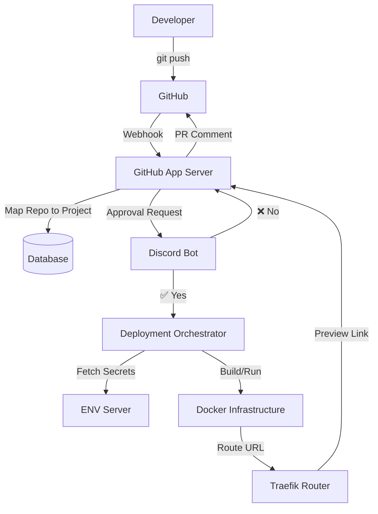

# High-Level Architecture

This system provides Vercel-style preview deployments for company repositories using self-hosted Docker infrastructure.

## System Diagram

## Core Design Goals
- Deployments triggered by GitHub events.
- Manual approval via Discord.
- Separate Docker containers per branch.
- Centralized ENV management.
- Automatic teardown on branch deletion.

---
[[Index|⬅️ Back to Index]]
